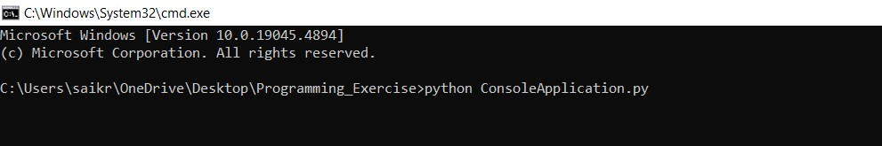
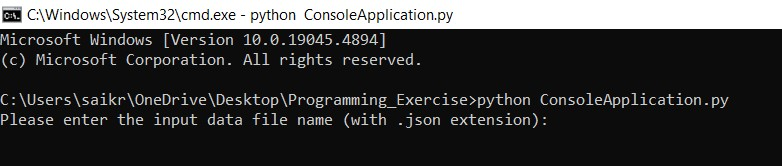
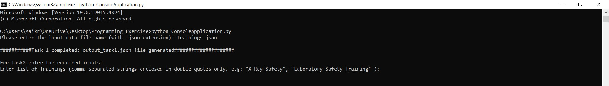
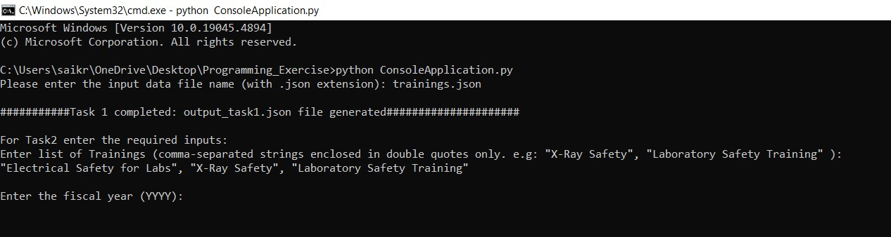
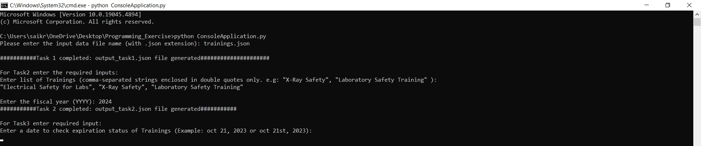
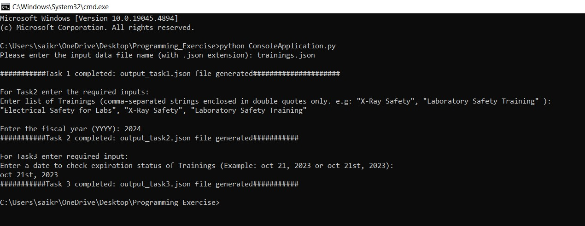

## Overview:

This Console Application processes the data from a JSON file to perform below operations:

1. Counts how many people have completed each training.
2. List people who completed the specific training during a fiscal year.
3. List the persons with trainings that have expired or will expire within a month of a given date.

## Outputs:

This console application generates three output JSON files:

output_task1.json:  Lists each Training with a count of how many people completed that course.

output_task2.json: Lists each  specified Training  with a list of people who completed that particular training in the specified fiscal year.

output_task3.json: Lists individuals with Trainings that are expired or expires soon based on the given date.

## Language used for developing the application:
    Python(version : 3.10)

## Requirements:

    Make sure you have Python installed in your machine.

## How to run the application:

### step 1 : 

* Clone the repository from github to local machine using the command: git clone <url>

### step 2 : 

* Open command prompt and navigate to the location of the folder where you have cloned the repository.

### step 3:

* Before running the application make sure the input file which contains json data is present in the same location or path where the application code is there.
* use the following command to run the application:   python ConsoleApplication.py
* After using the above command the console application starts running and its asks for the input file name in which json data is present. Enter the input file name(trainings.json) and press enter.(make sure .json extension is there)
* If file name is valid it will continue to next process else the program will exit.

### step 4:

* After successfully fetching the data from input file by default task1 will be executed as it    won't require any inputs and output json file(output_task1) for task1 will be generated.

### step 5:

* For task2 it will ask for two inputs.
* First input is, it asks for a list of Training names. Make sure you enter the each Training name  in double quotes separated by comma.
* Example: "X-Ray Safety","Transportation of Infectious Substances, Category B"
* After entering the Training names then press enter. Then it will ask for second input.
* Second input is, it asks for a fiscal year to enter. PLease enter the year in YYYY format only.
* Example: 2023
* After entering the year press enter.
* After giving the two inputs in correct formats the application will process the inputs and generates the output json file(output_task2).

### step 6:
* For task3 it will ask for one input.
* It will ask to enter a date, in order to check the expiration status of Training courses.
* please enter the complete date in correct format only.
*  Example: oct 21st, 2023  or  october 21, 2023
* After entering the date, the application will process the input and generates the output json file(output_task3).
		
		
##Images:

###Please see the below images in order wise to how to run the Console Application

